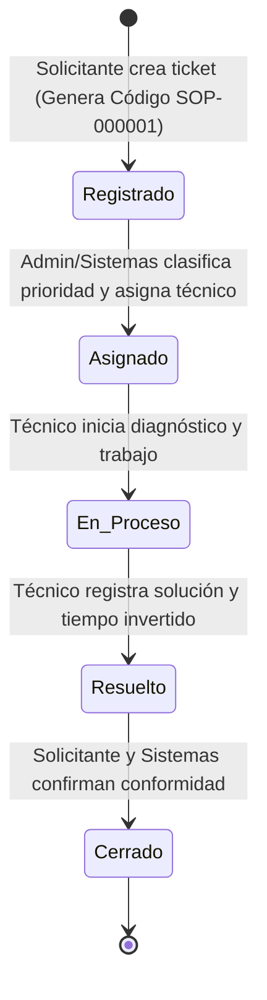

# Contexto y Reglas de Desarrollo - Sistema de Gestión de Soporte Técnico (COSMOL R.L.)

## 1. Visión General del Proyecto
El proyecto consiste en el **Sistema Web de Gestión de Soporte Técnico (Help Desk)** para **COSMOL R.L.**
Su propósito principal es digitalizar y automatizar el flujo de trabajo de **4 formularios físicos institucionales** (cada uno compuesto por anverso y reverso), eliminando el uso de papel y centralizando la gestión de incidentes y requerimientos técnicos.

* **Naturaleza del Sistema**: Aplicación Web Responsiva (Mobile-First y Desktop), accesible mediante navegador web (ej. Google Chrome) sin requerir instalación nativa en dispositivos móviles.
* **Escalabilidad y Flexibilidad**: La arquitectura debe ser **modular y extensible**, permitiendo la integración progresiva de los formularios 2, 3 y 4 sin romper la lógica del primer formulario ya definido.

---

## 2. Arquitectura del Sistema (Dockerizada y Modular)

El proyecto está diseñado bajo una arquitectura de 3 contenedores independientes orquestados por `docker-compose.yml`:

```
+-------------------------------------------------------------------------+
|                              ARQUITECTURA                               |
|                                                                         |
|   +-----------------------+     +-------------------+     +---------+   |
|   |       FRONTEND        |     |      BACKEND      |     |   BD    |   |
|   |  Nginx + HTML/CSS/JS  | <-> |  PHP 7.3 + Apache | <-> | Postgres|   |
|   |     Bootstrap 5       |     |     API / MVC     |     |   SQL   |   |
|   +-----------------------+     +-------------------+     +---------+   |
+-------------------------------------------------------------------------+
```

### Contenedores y Roles:
1. **Frontend (`frontend`)**:
   - **Stack**: Nginx, HTML5, CSS3, JavaScript (Vanilla / Modular), Bootstrap 5.
   - **Responsabilidad**: Interfaz de usuario adaptativa a pantallas de smartphones y escritorios, captura de datos, validaciones del lado del cliente y consumo de endpoints del backend.
2. **Backend (`backend`)**:
   - **Stack**: PHP 7.3 con servidor Apache.
   - **Responsabilidad**: Lógica de negocio, autenticación, control de accesos basado en roles (RBAC), validaciones del lado del servidor, gestión de estados de tickets, generación de correlativos y conexión persistente con PostgreSQL mediante PDO.
3. **Base de Datos (`database`)**:
   - **Stack**: PostgreSQL.
   - **Responsabilidad**: Almacenamiento relacional estructurado.
   - **Inicialización**: El script `database/init.sql` define esquemas, tablas, claves primarias/foráneas, índices y datos iniciales (roles, usuarios administradores, catálogos).

### Estructura de Directorios Modular Propuesta:
```text
Formulario_Registro/
├── AGENTS.md
├── docker-compose.yml
├── database/
│   └── init.sql
├── backend/
│   ├── Dockerfile
│   ├── config/
│   │   ├── database.php
│   │   └── config.php
│   ├── core/
│   │   ├── Router.php
│   │   ├── Controller.php
│   │   ├── Model.php
│   │   └── Auth.php
│   └── modules/
│       ├── auth/
│       ├── users/
│       ├── tickets/
│       │   ├── controllers/
│       │   ├── models/
│       │   └── views_or_routes/
│       ├── form1_soporte/        # Módulo Formulario 1 (Soporte Técnico Hardware/Software/Red)
│       └── reports/
└── frontend/
    ├── Dockerfile
    ├── nginx.conf
    ├── public/
    │   ├── index.html
    │   ├── assets/
    │   │   ├── css/
    │   │   ├── js/
    │   │   └── img/
    │   └── modules/
    │       ├── auth/
    │       ├── tickets/
    │       └── form1/
```

---

## 3. Roles y Permisos

1. **Solicitante (Trabajador / Usuario final)**:
   - Registro de nuevas solicitudes/problemas.
   - Consulta del estado de sus propios tickets.
   - Confirmación de conformidad una vez atendido el servicio.
2. **Técnico (Soporte de Sistemas)**:
   - Visualización de tickets asignados.
   - Registro de diagnóstico técnico, tareas realizadas, solución aplicada y tiempo de resolución.
   - Cambio de estado del ticket (En Diagnóstico, En Proceso, Resuelto).
   - Registro de observaciones y recomendaciones técnicas.
3. **Administrador (Jefe de Sistemas / Supervisor)**:
   - Control total de la plataforma.
   - Gestión de usuarios, técnicos, departamentos y categorías.
   - Asignación de tickets y definición de prioridades (Baja, Media, Alta, Urgente).
   - Generación de reportes métricos, tiempos de respuesta y exportaciones.

---

## 4. Ciclo de Vida y Flujo del Ticket (Formulario 1)



### Pasos Detallados:
1. **Creación del Ticket**: El solicitante registra su problema. El sistema asigna automáticamente un correlativo único (ej: `SOP-000001`).
2. **Revisión y Asignación**: El área de Sistemas evalúa la severidad, asigna prioridad y designa al técnico responsable.
3. **Atención Técnica**: El técnico ingresa al sistema desde su dispositivo móvil o PC, revisa los datos del equipo y registra el diagnóstico y procedimiento.
4. **Cierre y Conformidad**: Se registra la solución aplicada, el tiempo empleado y la conformidad digital del solicitante y del área de Sistemas.

---

## 5. Especificaciones de Datos del Formulario 1 (Base Inicial)

* **Datos Generales**: Fecha/hora, código de ticket, solicitante, departamento/área, contacto/interno.
* **Tipo de Soporte**: Hardware, Software, Red, Telefonía / Otros.
* **Datos del Equipo Afectado**: Número de inventario/serie, tipo de equipo, marca, modelo, sistema operativo.
* **Descripción del Problema**: Detalle del incidente reportado por el usuario.
* **Gestión Técnica**:
  - Prioridad (Baja / Media / Alta / Crítica).
  - Técnico asignado.
  - Diagnóstico técnico.
  - Trabajo realizado / Solución aplicada.
  - Tiempo de resolución (horas/minutos transcurridos o fecha de inicio y fin).
* **Cierre y Evaluación**:
  - Observaciones y recomendaciones preventivas.
  - Conformidad del solicitante (Aceptado / Conforme).
  - Visto Bueno / Conformidad del responsable de Sistemas.

---

## 6. Pautas y Buenas Prácticas para el Desarrollo

1. **Compatibilidad con PHP 7.3**:
   - Usar sintaxis compatible con PHP 7.3 (evitar características exclusivas de PHP 8+ como constructor promotion, named arguments, match expressions o tipos mixtos no soportados).
   - Utilizar sentencias preparadas con `PDO` para prevenir inyecciones SQL en PostgreSQL.
2. **Diseño Modular y Desacoplado**:
   - Cada formulario debe concebirse como un módulo que comparte una base común (Ticket Core) pero con sus campos y tablas especializadas.
   - El código debe estar preparado para incorporar los Formularios 2, 3 y 4 sin alterar la estructura fundamental del sistema.
3. **Diseño Responsivo (Mobile-First)**:
   - Todo formulario e interfaz debe ser 100% operable desde teléfonos móviles con pantallas táctiles, asegurando inputs accesibles, botones con área de toque adecuada y tablas con scroll responsivo.
4. **Seguridad y Trazabilidad**:
   - Encriptación de contraseñas (`password_hash` con BCRYPT/Argon2).
   - Manejo de sesiones seguras o tokens de autenticación.
   - Registro de marcas de tiempo (`created_at`, `updated_at`, `resolved_at`, `closed_at`) para auditoría.
